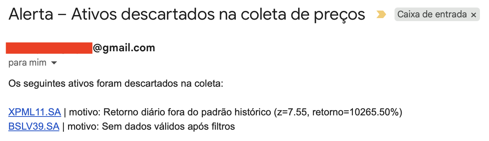
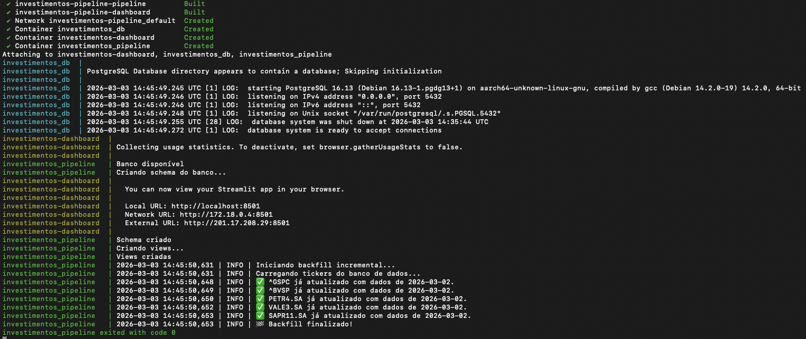

## Objetivo do Projeto
Desenvolver uma ferramenta para gestão financeira pessoal com as seguintes funções:
```
* Coleta diária automatizada de cotação dos ativos presentes na carteira
* Dashboard com comparativo do rendimento da carteira versus índices do mercado (CDI & Ibovespa)
* Análise da série histórica e geração de avaliação preditiva para suportar decisões de compra/venda/hold
```

## 🚧 Status do Projeto 🚧
Este projeto está em desenvolvimento ativo.

O que está sendo desenvolvido no momento:
```
-> Integração do pipeline com base de dados histórica
-> Normalização dos dados & Benchmarking
-> Dashboard interativo via Streamlit
```

Próximos passos:
```
X Migração de .csv para banco de dados - TBD
X Modelagem de séries temporais
X Análise preditiva para suportar tomada de decisões no portfolio
```

# Pipeline para coleta de preços de ações, ETFs, FIIs etc no YFinance

## 1. Introdução: Arquitetura e Fluxo do pipeline

### 1.1 Estrutura de pastas
Escolha um local para extrair as pastas conforme estrutura abaixo:
```    
Investimentos/
│
├── dashboard/
│   ├── app.py                  
│
│
├── docs/   
│   └── images/
│       ├── e-mail_automatico.png
│       └── pipeline_terminal.png
├── data/
│   ├── tickers.csv             # mantenha esse arquivo com todos os ativos que deseja coletar preços.
│   ├── precos_fechamento.csv.  # gerado automaticamente pelo pipeline
│   ├── historical/
│   │   └── precos_historicos.csv
│   └── checkpoints/
│       └── .gitkeep
│
├── logs/
│   └── .gitkeep                # gerados automaticamente pelo pipeline
│
├── scripts/
│   ├── coleta_precos.py
│   ├── backfill_historico.py
│   └── .env.example            # edite a sua SENHA_APP e renomeie para .env 
│
├── tests/
│   ├── test_data_files.py
│   └── test_pipeline_basic.py
│
│
│── README.md
├── README_LAUNCHD.md
├── pyproject.toml
├── requirements.txt
├── Dockerfile
├── docker-compose.yml
└── .gitignore
```

### 1.2 Visão macro da arquitetura

```
          ┌───────────────┐
          │ tickers.csv   │
          │ (input manual)│
          └───────┬───────┘
                  │
                  ▼
        ┌─────────────────────┐
        │ coleta_precos.py    │
        │                     │
        │ • leitura tickers   │
        │ • coleta yfinance   │
        │ • delay anti-rate   │
        │ • validação estat.  │
        │ • logging           │
        │ • checkpoint        │
        │ • alerta por e-mail │
        └───────┬─────────────┘
                │
        ┌───────┴───────────┐
        │                   │
        ▼                   ▼
┌──────────────────┐   ┌────────────────────┐
│ precos_fecham.   │   │ checkpoints diários│
│ (estado atual)   │   │ (auditoria/hist.)  │
└──────────────────┘   └────────────────────┘
                │
                ▼
        ┌─────────────────┐
        │ Excel / Power   │
        │ Query / Dash    │
        └─────────────────┘
```

### 1.3 Fluxo de execução do pipeline

```
1. launchd dispara automaticamente, mesmo com tela apagada/bloqueada (18:30)
2. Python inicia
3. tickers.csv é lido
4. Loop ticker a ticker
   ├── request yfinance
   ├── sleep 15s
   ├── filtro estatístico
   ├── log sucesso / descarte
5. precos_fechamentos.csv sobrescrito
6. checkpoint diário criado (se não existir)
7. e-mail enviado se houver descartes
8. logs finalizados
```

## 2. Preparando o seu ambiente para o pipeline

### 2.1: Criação do arquivo .env

Esse pipeline possui uma função que envia e-mail automaticamente em caso de erros durante a coleta de 
preços dos ativos. Não se preocupe, os e-mails são enviados somente quando ocorrem erros, ou seja, sem spam. Caso a coleta seja
concluída com sucesso, nada será enviado.
Para que o e-mail seja disparado, eu utilizei uma conta gmail como remetente. Para isso será necessário criar uma
SENHA_APP. Existem alguns tutorais na internet muitos simples mostrando como fazer isso.

Após criar a sua SENHA_APP, abra o arquivo ".env.example" com um editor de texto e substitua "SENHA_APP_DO_SEU_GMAIL" pela sua senha:
```
EMAIL_SENHA_APP=SENHA_APP_DO_SEU_GMAIL

```
Salve o arquivo e renomeie removendo o ".example". Deixe apenas como ".env". O arquivo ficará oculto na pasta.
Para ler o conteúdo do arquivo oculto, abra o terminal no caminho onde o arquivo está localizado e digite "cat .env".
Caso precise editá-lo, abra o terminal no caminho onde o arquivo está localizado e digite "nano .env". Após editar, salve (Ctrl + O), pressione Enter e feche (Ctrl + X).

Veja abaixo um exemplo de e-mail recebido pelo pipeline:



#### Nota3:
Caso queira compartilhar o projeto, você nunca deve versionar o arquivo .env. O repositório contêm apenas o arquivo .env.example como referência.

### 2.2: Criação do ambiente virtual via Docker

Abra o Docker (caso não tenha, faça o download/instalação antes de seguir).

Abra o terminal na raiz do projeto e digite o seguinte comando:
```bash
docker compose up --build -d
```
Serão criados uma imagem e um container para o projeto. Pronto, agora a aplicação terá um ambiente dedicado para ela!
O dashboard ficará disponível em:

```bash
http://localhost:8501
```

Quando finalizar o uso da aplicação, rode o seguinte código no terminal da pasta raiz do projeto:
```bash
docker compose down
```

#### Nota4:
A partir de agora a imagem e container já estão criados no Docker e não precisam ser recriados, mesmo que os códigos sejam alterados. Para acessar a aplicação basta usar o "compose up -d" e "compose down".
```bash
docker compose up --build -d   #Iniciar a imagem/container e rodar a aplicação
docker compose down            #Pausar tudo
``` 

### 2.3: Alimentação do tickers.csv
O pipeline inicia a sua busca através dos ativos listados dentro do arquivo "tickers.csv" que deve estar na pasta "data".
Portanto, para a sua rotina, mantenha esse arquivo atualizado com os ativos do seu portfolio, sempre com o nome "tickers.csv".
Essa atualização pode ser manual ou automatizada a depender de como você faz a sua gestão financeira.

### 2.4: Automatização do pipeline no MacOS - OPCIONAL

Caso queira automatizar esse pipeline, siga as instruções do README_LAUNCHD.
Eu particularmente acho isso muito prático, pois o meu computador rodar o pipeline automaticamente todo dia
as 18:30h, após fechamento do mercado (você pode alterar esse horário no .plist, está descrito no README_LAUNCHD). Dessa forma, a minha base de dados é alimentada automaticamente todos os dias com as cotações do dia anterior, sem que eu precise fazer nada.

Caso prefira rodar o código manualmente pelo terminal, basta executar o arquivo "coleta_precos.py" via Python.
Quando executado manualmente, o pipeline mostra o progresso de execução em tempo real, com todos os estágios relevantes na tela:




## 3. Tests

Testes básicos foram implementados usando `pytest` para validar:
- requisitos de arquivos de dados e estrutura de pastas
- lógica de execução básica do pipeline

Para rodar os testes localmente:
```bash
pytest
```


<h2>Author:</h2> 

Douglas Senra

